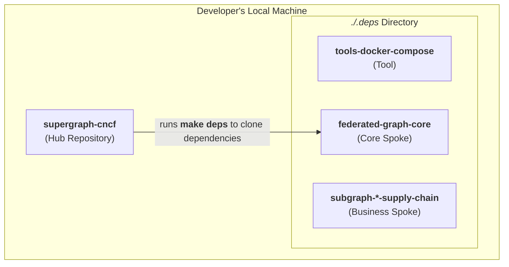
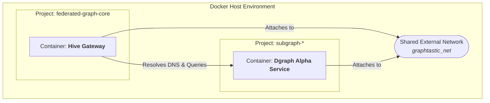
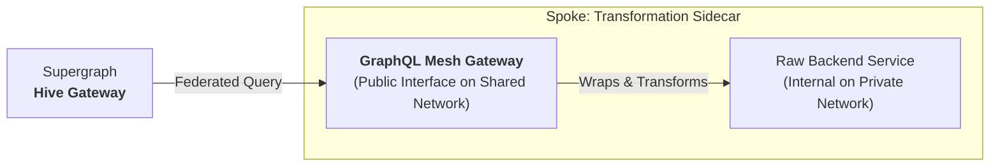

# The Graphtastic Platform

This repository serves as the architectural blueprint and central source of truth for the Graphtastic Platform. It contains the foundational documents that define the platform's vision, design principles, and governance model.

The core philosophy of the Graphtastic Platform is a **declarative, multi-repo architecture** designed for maximum reusability, clear ownership, and independent development. It enables teams to build, test, and deploy distributed GraphQL services (Spokes) that can be seamlessly composed into unified data graphs (Supergraphs) for specific use cases.

The following diagrams illustrate the core architectural concepts of the platform.

### 1. Platform Composition Model

The platform is founded on a modular "Hub and Spoke" model. A developer begins with a **Hub** repository (e.g., `supergraph-cncf`). The Hub's manifest (`graphtastic.deps.yml`) declaratively lists all required **Spoke** and **Tool** dependencies.

Running `make deps` from the Hub clones these version-controlled components into a local `./.deps` directory, creating a complete, self-contained development environment. This provides a monorepo-like experience for local development while maintaining a multi-repo structure for ownership and deployment.

### 2. Runtime Isolation & Communication

The Graphtastic Platform's runtime is not a monolith. Each component is launched as an isolated **Docker Compose Project**. This prevents resource collisions and allows for independent lifecycle management.

Communication between these isolated projects is enabled by a single, shared **External Docker Network**. Services attach to this network, which provides a common communication bus with reliable, built-in DNS. This is how the Hive Gateway in one project can resolve and query a Dgraph Spoke running in another.

### 3. The Transformation Sidecar Pattern

To integrate non-compliant, legacy, or complex services, the platform utilizes the **Transformation Sidecar Pattern**. This pattern encapsulates complexity *within* the Spoke, preserving a clean, federated contract with the supergraph.

A request from the Supergraph Gateway travels over the shared network to the Spoke's public interface: a **GraphQL Mesh Gateway**. This sidecar intercepts the request, connects to the **Internal Backend** (which is isolated on a private network), and applies a series of in-memory transformations. It then exposes a corrected, compliant, and federated schema back to the Supergraph, effectively acting as an API compatibility layer.

## Architectural Precepts

All development within the Graphtastic ecosystem must adhere to the following principles. These precepts are designed to maintain the architectural integrity of the platform, ensuring it remains scalable, maintainable, and resilient.

1. **Hubs Assemble, Spokes Provide:** Hubs contain no business logic. Spokes are the single source of truth for a business capability.
2. **Core Services Are Agnostic:** Core components (`federated-graph-core`, `tools-*`) must never depend on a specific business-domain subgraph. This ensures they remain generic and reusable.
3. **Subgraphs Are Standalone:** Every Spoke must be runnable in isolation via its own `compose.yaml`. This is a critical requirement for independent development and testing.
4. **Communicate Through the Supergraph:** Subgraphs must not communicate directly with each other over the network. Composition is achieved *only* through GraphQL Federation.
5. **Version with Intent:** Production releases must pin dependencies to specific, immutable version tags.

## The Developer Workflow: "Render, Commit, Run"

The platform is designed around a declarative, Git-based workflow. The composition of the supergraph is a build-time step that produces a version-controlled artifact.

1. **Declare:** A Hub's `graphtastic.deps.yml` manifest declares all required Spoke dependencies and their versions.
2. **Render:** An orchestration tool (`npx @graphql-mesh/compose-cli`) introspects the schemas of all dependent Spokes and composes them into a single `supergraph.graphql` artifact.
3. **Commit:** This generated supergraph artifact is committed directly to the Hub's Git repository. It is a declarative build product, not a runtime variable.
4. **Run:** At runtime, the Hive Gateway is configured to load the static, committed `supergraph.graphql` file, ensuring the running system is an exact representation of the version-controlled code.

## Getting Started

To understand the complete architectural vision and detailed rationale behind these patterns, please refer to the primary architectural document:

* **[The Graphtastic Platform Tome](./docs/design/tome--graphtastic-platform-docker-compose.md#)**

## Licensing

This project is dual-licensed to enable broad code adoption while ensuring our documentation and knowledge base remain open for the community. Project copyright and contributor attribution are managed in our [`NOTICE`](./NOTICE) and [`CONTRIBUTORS.md`](./CONTRIBUTORS.md) files.

* **Code is licensed under [Apache 2.0](https.www.apache.org/licenses/LICENSE-2.0).** This permissive license allows free use in both open-source and commercial products. The full license text is in [`LICENSE.code`](./LICENSE.code).

* **Documentation is licensed under [CC BY-SA 4.0](https://creativecommons.org/licenses/by-sa/4.0/).** This requires **Attribution** for our contributors and that derivative works are shared back under the same **ShareAlike** terms. The full license text is in [`LICENSE.docs`](./LICENSE.docs).