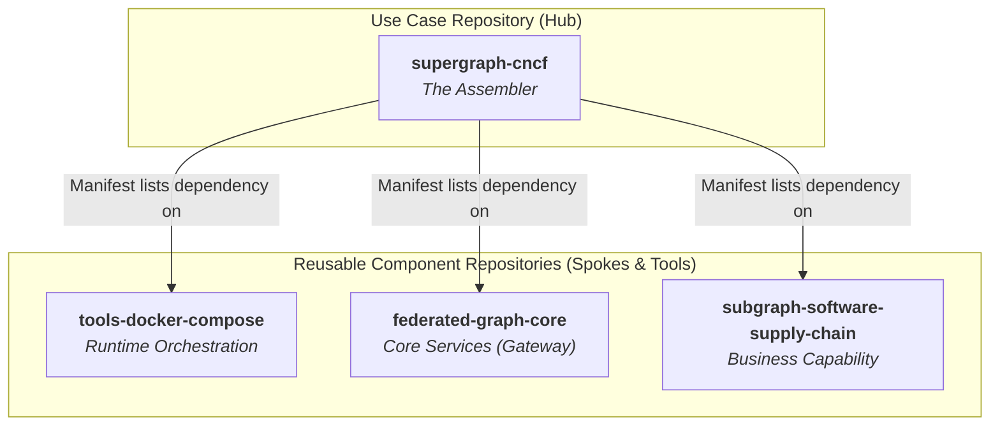
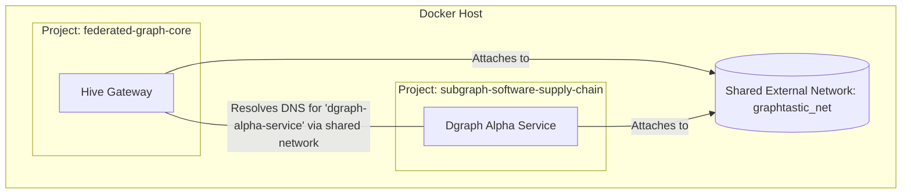
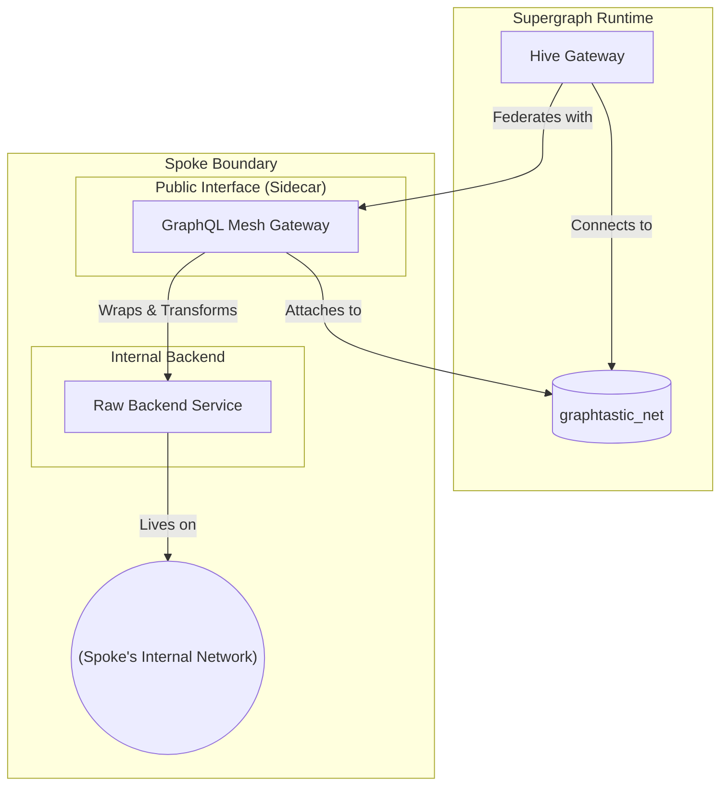

# The Graphtastic Platform

This repository serves as the architectural blueprint and central source of truth for the Graphtastic Platform. It contains the foundational documents that define the platform's vision, design principles, and governance model.

The core philosophy of the Graphtastic Platform is a **declarative, multi-repo architecture** designed for maximum reusability, clear ownership, and independent development. It enables teams to build, test, and deploy distributed GraphQL services (Spokes) that can be seamlessly composed into unified data graphs (Supergraphs) for specific use cases.

## The "Hub and Spoke" Architectural Model

The platform is founded on a modular "Hub and Spoke" model that separates concerns into distinct, version-controlled repositories. This structure promotes a true microservice philosophy while providing a productive developer experience.

*   **Hubs (`supergraph-*`):** Lightweight "assembler" repositories. A Hub contains no business logic; its sole purpose is to declare a list of Spoke dependencies and their versions in a manifest file (`graphtastic.deps.yml`). It defines a specific "use case" by composing the required capabilities.
*   **Spokes (`subgraph-*`, `federated-graph-core`):** Self-contained, runnable, and independently versionable components. Each Spoke is the single source of truth for a specific business capability or technical function, exposing its data via a GraphQL schema.
*   **Tools (`tools-*`):** Reusable components that provide the orchestration and governance logic for the entire ecosystem, ensuring a consistent and updatable management process.
*   **Templates (`template-*`):** Boilerplate repositories that serve as the starting point for creating new Hubs or Spokes, ensuring they adhere to platform conventions from day one.

## Architectural Precepts

All development within the Graphtastic ecosystem must adhere to the following principles. These precepts are designed to maintain the architectural integrity of the platform, ensuring it remains scalable, maintainable, and resilient.

1.  **Hubs Assemble, Spokes Provide:** Hubs contain no business logic. Spokes are the single source of truth for a business capability.
2.  **Core Services Are Agnostic:** Core components (`federated-graph-core`, `tools-*`) must never depend on a specific business-domain subgraph. This ensures they remain generic and reusable.
3.  **Subgraphs Are Standalone:** Every Spoke must be runnable in isolation via its own `compose.yaml`. This is a critical requirement for independent development and testing.
4.  **Communicate Through the Supergraph:** Subgraphs must not communicate directly with each other over the network. Composition is achieved *only* through GraphQL Federation.
5.  **Version with Intent:** Production releases must pin dependencies to specific, immutable version tags.

## Runtime Architecture: Isolated Projects on a Shared Bus

The Graphtastic Platform's runtime is not a monolithic application but a system of coordinated, independent Docker Compose projects. This provides strong isolation while a shared network enables them to function as a cohesive whole.

*   **Project Isolation:** Each component (e.g., `federated-graph-core`, `subgraph-software-supply-chain`) is launched as a distinct Docker Compose project. This prevents resource collisions and allows for independent lifecycle management.
*   **Shared Communication Bus:** A single, external Docker network is created (e.g., `graphtastic_net`). Services that need to communicate (like the Hive Gateway and a Spoke's GraphQL endpoint) attach to this shared network, which provides reliable, built-in DNS for service discovery.

### Advanced Spoke Pattern: The Transformation Sidecar

To integrate non-compliant, legacy, or complex services, the platform utilizes the **Transformation Sidecar Pattern**. This pattern encapsulates complexity *within* the Spoke, preserving a clean, federated contract with the supergraph.

An internal backend service is confined to the Spoke's internal Docker network. A public-facing GraphQL Mesh gateway acts as a "sidecar," connecting to the internal backend, applying in-memory transformations to its schema, and exposing a compliant, federated interface to the shared network.

## The Developer Workflow: "Render, Commit, Run"

The platform is designed around a declarative, Git-based workflow. The composition of the supergraph is a build-time step that produces a version-controlled artifact.

1.  **Declare:** A Hub's `graphtastic.deps.yml` manifest declares all required Spoke dependencies and their versions.
2.  **Render:** An orchestration tool (`npx @graphql-mesh/compose-cli`) introspects the schemas of all dependent Spokes and composes them into a single `supergraph.graphql` artifact.
3.  **Commit:** This generated supergraph artifact is committed directly to the Hub's Git repository. It is a declarative build product, not a runtime variable.
4.  **Run:** At runtime, the Hive Gateway is configured to load the static, committed `supergraph.graphql` file, ensuring the running system is an exact representation of the version-controlled code.

## Getting Started

To understand the complete architectural vision and detailed rationale behind these patterns, please refer to the primary architectural document:

*   **[The Graphtastic Platform Tome](./docs/tome--graphtastic-platform-docker-compose.md)**