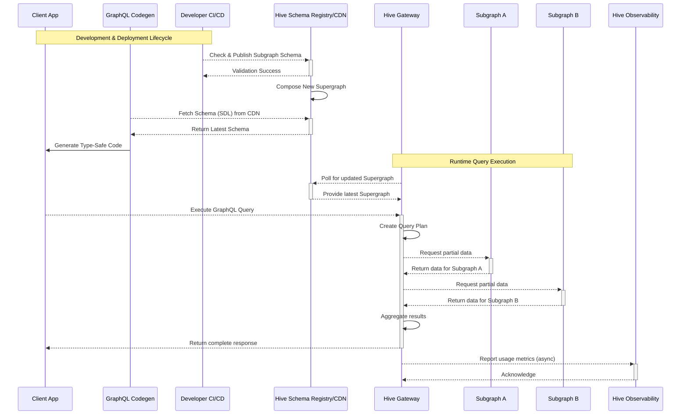
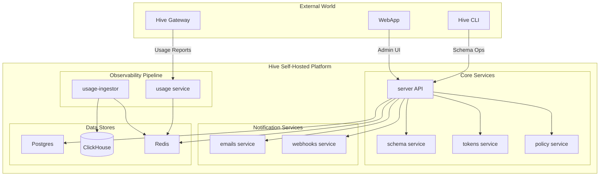

# A Technical Deep Dive into the GraphQL Hive Platform: Architecture, Deployment, and Integration

GraphQL Hive is a comprehensive, open-source platform engineered to manage the complete lifecycle of a **federated GraphQL API**. It isn't a single tool but an integrated suite of services designed to address the core challenges of distributed graph architectures: schema management, query execution, and operational visibility. The platform's design supports a variety of GraphQL architectures, including Apollo Federation, schema stitching, and traditional standalone APIs, making it a versatile solution for diverse technical environments. A fundamental characteristic of the Hive platform is its commitment to open source; all components are licensed under the permissive **MIT license**, offering teams the freedom to self-host the entire stack on their own infrastructure or utilize the managed cloud service provided by The Guild.

---

## 1.1 Core Pillars: Unifying the Gateway, Registry, and Observability

The Hive platform is built upon three tightly integrated pillars: the **Schema Registry**, the **Gateway**, and the **Observability** service. This unification is the cornerstone of its architecture and enables a level of functionality that is difficult to achieve with loosely coupled, disparate tools.

*   **Schema Registry**: This is the central source of truth for the entire GraphQL schema. It manages the versions of all subgraph schemas, performs schema composition to create a unified supergraph, and runs critical validation and compatibility checks to prevent breaking changes.

*   **Gateway**: The Hive Gateway is the public-facing entry point for all client applications. It ingests the supergraph from the Schema Registry and uses it to intelligently plan and execute queries across the various downstream subgraphs. It is responsible for routing, data aggregation, and enforcing security policies.

*   **Observability**: This component collects, processes, and analyzes detailed metadata from the Gateway about API usage. It tracks performance metrics, error rates, client consumption patterns, and field-level usage statistics without inspecting sensitive payload data.

The power of this integrated design is most evident in advanced features like "**conditional breaking changes**". In a traditional setup, removing a field from a schema is always flagged as a breaking change. Hive, however, leverages the data from its Observability pillar to inform the Schema Registry. If the usage data shows that no client has queried a specific field for a significant period, the Registry can permit its removal without flagging it as a critical break, thereby reducing development friction while maintaining API stability. This data-driven approach to schema governance is a direct result of the deep architectural integration of its core components.

---

## 1.2 System Architecture and Data Flow for Federated Graphs

The interaction between Hive's components, development workflows, and client applications follows a well-defined lifecycle. This flow ensures that schema changes are validated before deployment and that the runtime environment is always operating on the latest, correct version of the supergraph. The typical data flow can be broken down into two main phases: the **development and deployment lifecycle**, and the **runtime query execution lifecycle**.

**Development & Deployment Lifecycle:**

*   **Schema Evolution**: A developer working on a subgraph makes a change to its GraphQL schema. As part of the continuous integration (CI) process, the proposed schema is sent to the Hive Registry for validation using the Hive CLI.

*   **Schema Checks & Composition**: The Registry checks the new subgraph schema for breaking changes against the currently active supergraph. It also performs a composition check to ensure the new schema is compatible with all other subgraphs. If validation passes, the CI build proceeds.

*   **Schema Publication**: Upon a successful merge to the main branch, the continuous deployment (CD) pipeline publishes the final version of the subgraph schema to the Registry. The Registry then composes and stores a new version of the supergraph.

*   **Client-Side Code Generation**: Concurrently, frontend or client application developers can use tools like GraphQL Codegen to fetch the latest supergraph schema directly from Hive's high-availability Content Delivery Network (CDN). This allows them to generate fully type-safe API wrappers, ensuring their code is always synchronized with the backend schema.

**Runtime Query Execution:**

*   **Gateway Configuration**: The Hive Gateway, running in production, periodically polls the Hive CDN to fetch the latest version of the supergraph. This ensures it always has the most up-to-date query plan blueprint.

*   **Client Request**: A client application sends a GraphQL query to the single endpoint exposed by the Hive Gateway.

*   **Query Planning & Execution**: The Gateway parses the incoming query and, using its knowledge of the supergraph, creates an efficient query plan. It determines which fields need to be fetched from which subgraphs.

*   **Subgraph Delegation**: The Gateway executes the plan, sending targeted requests to the necessary downstream subgraphs. This may involve parallel requests to multiple services.

*   **Response Aggregation**: As the subgraphs return their data, the Gateway aggregates the partial responses into a single, cohesive GraphQL response that matches the shape of the original client query.

*   **Usage Reporting**: Asynchronously, the Gateway reports metadata about the operation (e.g., which fields were used, latency, client identity, success/error status) to the Hive Observability service for analysis and storage.

This end-to-end flow is visualized in the following diagram:



---

## 1.3 The Self-Hosted Microservices Ecosystem

For teams choosing to self-host, the Hive platform is not a monolithic application but a distributed system composed of specialized microservices, each with a distinct responsibility. This architectural choice is a deliberate trade-off, prioritizing scalability and separation of concerns over operational simplicity.

The self-hosted architecture comprises the following key services:

*   **server**: The main GraphQL API for the Hive platform itself, orchestrating calls to other services and serving the web application UI.

*   **cdn**: A service responsible for serving schema artifacts (like the supergraph SDL) with high availability. In the self-hosted architecture, this is provided as part of the server.

*   **schema**: Handles the computationally intensive tasks of validating, diffing, and composing GraphQL schemas.

*   **tokens**: Manages the creation and validation of access tokens used for authentication and authorization.

*   **usage**: The ingestion endpoint for observability data. It receives usage reports from gateways and places them into a queue for processing.

*   **usage-ingestor**: A worker service that consumes usage data from the queue, processes it, and stores it in the analytics database.

*   **emails**: Manages the sending of transactional emails (e.g., notifications, alerts).

*   **webhooks**: Responsible for sending webhook notifications to external systems like Slack or custom endpoints.

*   **policy**: A service dedicated to validating and enforcing schema policies.

This suite of services is supported by a **polyglot persistence layer**, leveraging the optimal database technology for each type of data.

*   **PostgreSQL**: Used as the primary relational database for storing structured data such as user accounts, organizations, projects, and schema history.

*   **Redis**: Serves as a high-speed cache and a message broker, queuing usage reports between the usage and usage-ingestor services.

*   **ClickHouse**: A high-performance, column-oriented database specifically designed for Online Analytical Processing (OLAP). It stores the vast amounts of usage and metrics data, enabling the fast aggregations and analytics seen in the Hive dashboard. The choice of ClickHouse over alternatives like Elasticsearch was a strategic decision to achieve significant performance gains at scale.

The internal architecture of the self-hosted platform is illustrated below:



This microservices approach provides significant benefits in terms of scalability and resilience. For instance, during periods of high query traffic, the usage and usage-ingestor services can be scaled independently of the schema service, which is primarily active during CI/CD runs. However, this design introduces non-trivial operational complexity. An engineering team opting for the self-hosted solution must be prepared to deploy, monitor, and maintain a distributed system with multiple moving parts and three distinct database technologies. This operational overhead is a critical factor to weigh when deciding between the self-hosted and cloud-managed versions of Hive.

---

# 2. Hive Gateway v1: The Open-Source Federation Engine

The Hive Gateway is the runtime component of the Hive platform, acting as the central nervous system for a federated GraphQL architecture. The version 1 release represents a significant milestone, establishing the gateway as a mature, feature-rich, and standalone product within The Guild's ecosystem. It is positioned as a direct, fully open-source alternative to Apollo Router, designed to serve federated graphs with high performance and extensive customizability.

---

## 2.1 Core Capabilities and Feature Set of Hive Gateway v1

The V1 release of Hive Gateway was announced in conjunction with GraphQL Mesh v1, marking a strategic decoupling of the two projects. While GraphQL Mesh now focuses exclusively on composing various data sources (REST, gRPC, databases, etc.) into a federated GraphQL schema, Hive Gateway's sole purpose is to serve that federated schema as a high-performance gateway. This modularity allows teams to use each component independently; for example, using Hive Gateway to serve a supergraph composed by Apollo's Rover CLI.

Hive Gateway is designed for maximum deployment flexibility, catering to a wide range of operational environments. It can be run as.

*   A **standalone, pre-compiled binary**, requiring no Node.js installation.

*   A **Docker image**, simplifying containerized deployments.

*   A **JavaScript package**, enabling integration into various serverless and Node.js environments (e.g., Deno, Bun, Cloudflare Workers, AWS Lambda, Express).

The feature set of Hive Gateway v1 is comprehensive, providing many capabilities out-of-the-box that are often considered enterprise-grade.

*   **Federation**: Native support for Apollo Federation v1 and v2 specifications.

*   **Subscriptions**: Full support for GraphQL Subscriptions via WebSockets, Server-Sent Events (SSE), or HTTP callbacks.

*   **Authentication & Authorization**: Built-in support for JSON Web Tokens (JWT) for securing both client-to-gateway and gateway-to-subgraph communication.

*   **Observability**: First-class integration with OpenTelemetry for distributed tracing and Prometheus for metrics, allowing for deep operational insight.

*   **Persisted Documents**: Support for persisted queries, which can improve performance and security by allowing clients to send a hash instead of the full query string.

*   **Performance Optimizations**: Includes features like automatic query batching, request deduplication, and end-to-end HTTP compression.

*   **Security**: Provides mechanisms for rate limiting, query complexity analysis, disabling introspection, and more to protect the API from abuse.

---

## 2.2 Technical Comparison: Hive Gateway vs. Apollo Router

For any team considering Hive Gateway, the most direct comparison is with Apollo Router. While both serve the same fundamental purpose—executing queries across a federated graph—they are built on fundamentally different philosophies and technologies, leading to important trade-offs.

| Feature | Hive Gateway v1 | Apollo Router |
| :---- | :---- | :---- |
| **License** | MIT | Elastic License v2 |
| **Core Technology** | Node.js / TypeScript | Rust |
| **Performance Profile** | Good; typical of Node.js event loop architecture. | Excellent; lower latency, higher throughput due to compiled Rust binary. |
| **Extensibility** | JavaScript/TypeScript plugins (large ecosystem) | Rust plugins or Rhai scripting |
| **Dependencies** | Higher (Node.js runtime, npm packages) | Lower (precompiled binary) |
| **Ecosystem** | Open; works with Hive, GraphOS, etc. | Tightly integrated with Apollo GraphOS |
| **Federation Support** | Federation v1 & v2 | Federation v1 & v2 |

The most significant differentiator is the choice of core technology: **Node.js/TypeScript** for Hive Gateway versus **Rust** for Apollo Router. This isn't merely an implementation detail but a strategic architectural decision that impacts performance, extensibility, and the developer experience.

Apollo's choice of Rust is a clear optimization for raw performance. As a compiled, systems-level language, Rust allows Apollo Router to achieve significantly lower latency and higher throughput, making it an ideal choice for high-traffic edge deployments where every millisecond of processing time is critical. The trade-off is a more constrained and specialized model for customization, requiring developers to write extensions in Rust or the Rhai scripting language, which may be unfamiliar to many web development teams.

Conversely, Hive Gateway's foundation in the Node.js and TypeScript ecosystem prioritizes developer familiarity, a vast library ecosystem, and rapid extensibility. For the vast majority of engineering teams, whose primary expertise lies in JavaScript/TypeScript, customizing and extending Hive Gateway is a far more accessible task. The performance, while not matching a finely-tuned Rust binary, is generally more than sufficient for a wide range of applications. Community discussions have highlighted that this technological difference can even lead to different query planning and execution behaviors, with potential impacts on latency that should be validated for specific use cases.

Therefore, the choice between Hive Gateway and Apollo Router is a strategic one. It is a decision between prioritizing **absolute, best-in-class performance** with a steeper customization curve (Apollo Router) versus prioritizing **ecosystem familiarity**, ease of extension, and a fully permissive open-source license with very strong performance (Hive Gateway). A thorough performance analysis with realistic production traffic patterns should be a key component of any evaluation process.

---

## 2.3 Extensibility with Plugins

Hive Gateway's extensibility is one of its most powerful features, stemming from its use of the **Envelop plugin system**, which also powers GraphQL Yoga. This architecture allows developers to inject custom logic into nearly every phase of a GraphQL operation's lifecycle (e.g., parsing, validation, execution, result). This is typically achieved by creating a gateway.config.ts file and providing an array of plugins. These plugins can be used to add a wide range of custom functionalities, such as:

*   **Security Hardening**: Adding security-focused plugins like @escape.tech/graphql-armor-block-field-suggestions to prevent introspection-based attacks.

*   **Custom Monitoring**: Implementing a plugin to capture detailed timing metrics for specific parts of the query resolution process and reporting them to a custom monitoring system.

*   **Dynamic Authentication**: Creating a plugin that integrates with a complex, in-house authentication service to validate credentials on each incoming request.

This plugin-based approach is highly maintainable, as it allows teams to add complex, business-specific logic without needing to fork or modify the core gateway code. It promotes a clean separation of concerns and leverages the vast npm ecosystem for pre-built solutions.

---

# 3. The Hive Schema Registry: Ensuring API Integrity and Evolution

The Hive Schema Registry is the authoritative hub for managing a federated GraphQL API. It acts as the "**source of truth**" for the graph's structure, providing the tools necessary for safe, collaborative evolution across multiple teams and services. Its primary functions are to compose the supergraph, enforce schema governance through automated checks, and enable a data-driven approach to API development.

---

## 3.1 Managing Federated Schemas: The Supergraph Composition Workflow

In a federated architecture, no single service owns the entire schema. Instead, each domain-specific service (**subgraph**) defines and exposes its own piece of the graph. The role of the schema registry is to consume all these individual subgraph schemas and compose them into a single, unified **supergraph**. This supergraph is the complete map of the entire federated API, which the Hive Gateway then uses to plan and execute queries.

The workflow within Hive is straightforward and designed for automation.

1.  **Publish**: Each subgraph team uses the Hive CLI (hive schema:publish) to push their schema's Schema Definition Language (SDL) to the registry. This command typically includes metadata such as the service name, its URL, the author of the change, and a commit hash for versioning.

2.  **Compose & Validate**: Upon receiving a new or updated subgraph schema, Hive triggers a composition process. It attempts to merge the new schema with all other existing schemas for that target environment. This is more than a simple concatenation; Hive's composition engine validates compatibility, checks for conflicts in type definitions, and ensures that federation directives (like @key, @requires, @external) are used correctly.

3.  **Store & Serve**: If composition is successful, the new supergraph is stored and made available via Hive's high-availability CDN. The gateway can then poll this CDN endpoint to retrieve the updated supergraph and reload its configuration without downtime.

This centralized composition and validation process is critical for preventing a wide class of runtime errors. By ensuring that all subgraphs are compatible **before** a new supergraph is deployed, Hive guarantees the integrity of the federated graph.

---

## 3.2 Integrating Schema Governance into CI/CD Pipelines

To make schema governance a proactive part of the development process, Hive provides robust **CI/CD integration**. This "**shifts left**" the responsibility of ensuring schema safety, catching potential issues before they are ever merged into the main codebase.

The core of this integration is the hive schema:check command. When run in a CI pipeline (e.g., as part of a pull request workflow), this command sends the proposed schema changes to the Hive registry. The registry then performs a diff against the latest valid schema for that target and runs a series of checks.

*   **SDL Validation**: Ensures the proposed schema is valid GraphQL SDL.

*   **Breaking Change Detection**: Analyzes the changes to identify any modifications that could break existing clients (e.g., removing a field, changing a field's type, making a nullable field non-nullable).

*   **Composition Validation**: Simulates the composition process to ensure the changes are compatible with the other subgraphs.

If any of these checks fail, the CLI command will exit with a non-zero status code, causing the CI pipeline to fail. This provides immediate, automated feedback directly within the developer's workflow. Hive offers a GitHub App that integrates these checks directly into pull requests, displaying the results as a status check, similar to unit tests or code linting. Notifications can also be configured for Slack or custom webhooks to alert the relevant teams of schema changes or failures.

---

## 3.3 Advanced Schema Safety: Conditional Breaking Changes

Perhaps the most innovative feature of the Hive Schema Registry is its support for "**Conditional Breaking Changes**". This feature fundamentally redefines what constitutes a "breaking" change by making the determination data-driven rather than purely static.

In a traditional static analysis system, any change that violates the GraphQL specification's rules for backward compatibility is flagged as breaking. This can lead to a high number of "**false positives**"—changes that are technically breaking but have zero real-world impact because the affected part of the schema is not actively used by any clients. This creates unnecessary friction for developers, blocking valid refactoring and slowing down API evolution.

Hive's approach is different. By leveraging the usage data collected by its observability pipeline, the schema registry can determine if a particular field, argument, or type is actually being used in production. When the schema:check command is run with the conditional breaking changes feature enabled, a technically breaking change (like removing a field) will only cause the check to fail if Hive's usage data shows that the field has been queried by a client within a configurable time window (e.g., the last 90 days).

This feature is incredibly powerful for accelerating development and enabling safe, confident schema evolution. However, its adoption implies a critical architectural dependency: the integrity of the CI/CD pipeline becomes coupled to the reliability and completeness of the production observability data. If the usage reporting from the gateway is misconfigured, incomplete, or if a client uses a field very infrequently (e.g., for a quarterly report that hasn't run in the last 90 days), the system could incorrectly approve a change that will, in fact, break that client. Therefore, teams that adopt this feature must invest in ensuring their observability pipeline is robust, comprehensive, and accurately reflects the behavior of all API consumers.

---

# 4. Observability and Analytics: Gaining Insight into API Usage

GraphQL Hive's observability pillar provides deep, actionable insights into API performance and consumption. It is not merely a monitoring tool but an analytics engine that powers other critical parts of the platform, such as the conditional breaking changes feature. The system is designed to collect detailed metadata while respecting user privacy and data security.

---

## 4.1 The Data Collection Pipeline

Data collection begins at the Hive Gateway. The @graphql-hive/client library, integrated as a plugin into the gateway, intercepts every GraphQL operation. It is crucial to note that this client is designed to **only collect metadata** about the request and its execution. It explicitly **does not collect or store sensitive data** from the operation's variables or response body, which is a critical consideration for security and compliance.

The metadata collected for each operation includes.

*   **Operation Details**: The operation name (if provided) and type (query, mutation, or subscription).

*   **Schema Coordinates**: A list of all fields, arguments, and types used in the operation (e.g., Query.user, User.id).

*   **Client Information**: A client identifier (name and version), typically extracted from HTTP headers, to track usage by different consumers.

*   **Performance Metrics**: Execution duration (latency) and the final status of the operation (success or error).

This metadata is then sent from the gateway to the self-hosted usage service. To handle high volumes of traffic without impacting gateway performance, the usage service acts as a lightweight ingestion endpoint that places the incoming reports into a Redis queue. The usage-ingestor service, a separate worker, consumes from this queue in the background, processes the batches of reports, and writes the final, structured data into the ClickHouse database for long-term storage and analysis.

---

## 4.2 Analyzing Performance and Consumption via the Hive Dashboard

Once the data is stored in ClickHouse, the Hive web dashboard provides a rich set of visualizations and analytics tools to explore it. This UI allows engineering and product teams to gain a comprehensive understanding of their API's health and usage patterns.

Key metrics and views available in the dashboard include:

*   **High-Level Statistics**: An overview of total GraphQL requests, average requests per minute (RPM), overall success and error rates, and API latency percentiles (p90, p95, p99).

*   **Operation-Level Monitoring**: A detailed breakdown of every unique GraphQL operation, showing its individual RPM, latency, and error rate. This is invaluable for identifying and debugging slow or problematic queries.

*   **Client Breakdown**: A view showing which client applications (e.g., web-app@1.2.0, ios-app@2.5.1) are responsible for what volume of traffic, helping to understand the impact of different consumers on the API.

*   **Schema Usage**: Analytics on which types and fields in the schema are most and least used, which directly informs deprecation policies and development priorities.

These tools empower teams to move beyond simple health monitoring and make data-driven decisions about API design, performance optimization, and resource allocation.

---

## 4.3 Integrating with the Observability Stack (Prometheus & Grafana)

While the Hive dashboard provides powerful analytics, many organizations have an established, centralized monitoring stack. Hive is designed to integrate seamlessly with these existing systems. The Hive Gateway exposes a metrics endpoint in a format compatible with **Prometheus**, a leading open-source monitoring and alerting toolkit.

This allows platform and SRE teams to scrape operational metrics directly from the gateway, just as they would with any other piece of critical infrastructure. These metrics can include request counts, latency histograms, error counters, and more. To simplify visualization, a pre-built **Grafana** dashboard is available specifically for Hive Gateway metrics.

This integration is crucial for production operations. It means that alerting on gateway health (e.g., "p99 latency is above 500ms for 5 minutes") and correlating gateway performance with other system events can be done within the organization's existing, familiar monitoring tools. It ensures that the GraphQL gateway is not a "black box" but a fully observable component of the production environment.

---

# 5. Deployment Guide: From Local Development to Production

This section provides practical, actionable guidance for deploying the GraphQL Hive platform. It covers both the standalone Hive Gateway for local development and the full self-hosted platform for production-like environments, with instructions for both Docker Compose and Kubernetes.

---

## 5.1 Local Environment Setup with Docker Compose

**Docker Compose** is the recommended and most straightforward method for running Hive locally, whether for a single gateway or the entire platform stack.

### 5.1.1 Standalone Gateway Deployment

For teams that only need to run the gateway locally (e.g., to connect to a cloud-hosted Hive registry or test against local subgraphs), a simple Docker Compose setup is sufficient. The official Hive Gateway image is available from the GitHub Container Registry (ghcr.io/graphql-hive/gateway).

The deployment process involves creating a docker-compose.yml file that defines the gateway service and mounts the necessary configuration files. The gateway can be configured to load a local supergraph.graphql file or to fetch it dynamically from the Hive CDN.

Below is an example docker-compose.yml for running a standalone gateway that serves a local supergraph file. This setup assumes two subgraph services (users and products) are also running and accessible to the gateway.

```yaml
# docker-compose.yml
version: '3.8'

services:
  # Example User Subgraph Service
  users-subgraph:
    image: my-user-service:latest
    ports:
      - "4001:4001"
    #... other service configuration

  # Example Products Subgraph Service
  products-subgraph:
    image: my-product-service:latest
    ports:
      - "4002:4002"
    #... other service configuration

  hive-gateway:
    image: ghcr.io/graphql-hive/gateway:latest
    command: supergraph # Command to run in supergraph mode
    ports:
      - "4000:4000"
    volumes:
      # Mount the local supergraph file into the container
      - ./supergraph.graphql:/gateway/supergraph.graphql
      # Optionally, mount a gateway config file for advanced features
      - ./gateway.config.ts:/gateway/gateway.config.ts
    environment:
      # Environment variables for connecting to a Hive Registry for observability
      HIVE_REGISTRY_TOKEN: "your-hive-token-for-usage-reporting"
      HIVE_REGISTRY_ENDPOINT: "https://your-hive-instance/graphql"
    depends_on:
      - users-subgraph
      - products-subgraph
```

To start this environment, run docker compose up. The Hive Gateway will be accessible on http://localhost:4000.

### 5.1.2 Full Self-Hosted Platform Deployment

The official and recommended method for deploying the entire self-hosted Hive platform is using the docker-compose.community.yml file provided in the graphql-hive/console GitHub repository. This comprehensive file defines all the required Hive microservices and their backing data stores (PostgreSQL, ClickHouse, Redis).

The setup process is as follows:

1.  **Download the Compose File**: Obtain the latest docker-compose.community.yml from the official repository.

    ```bash
    curl -O https://raw.githubusercontent.com/graphql-hive/console/main/docker/docker-compose.community.yml
    ```

2.  **Configure Environment Variables**: The platform requires several environment variables for configuration, particularly for secrets. It is best practice to store these in a .env file in the same directory as the compose file.

    ```sh
    #.env
    # Pin to a specific, stable version to avoid unexpected updates
    DOCKER_TAG=":3.0.0"
        DOCKER_REGISTRY="ghcr.io/graphql-hive/"
    
    # Secret for encrypting sensitive data
        HIVE_ENCRYPTION_SECRET=$(openssl rand -hex 16)
    
    # The public-facing URL of your Hive instance
        HIVE_APP_BASE_URL="http://localhost:8080"
    
    # Email configuration
        HIVE_EMAIL_FROM="no-reply@your-domain.com"
    
    # API key for SuperTokens authentication service
        SUPERTOKENS_API_KEY=$(openssl rand -hex 16)
    
        # Add other required variables for database passwords, etc., as per the documentation
    ```

3.  **Start the Platform**: With the compose file and .env file in place, start all services.

    ```bash
    docker compose -f docker-compose.community.yml up -d
    ```

For production deployments, it is **strongly recommended not** to run databases within Docker containers. The docker-compose.community.yml file should be modified to remove the database services (PostgreSQL, ClickHouse, Redis), and the environment variables for the Hive services should be updated to point to external, managed database instances.

---

## 5.2 Production Deployment with Kubernetes

While deploying to **Kubernetes** is a common requirement for production systems, the path for GraphQL Hive is less mature than the Docker Compose approach and carries a higher operational burden.

### 5.2.1 Analysis of the Community Helm Chart

An unofficial, community-maintained **Helm chart** is available on Artifact Hub under the name diabolocom/graphql-hive. Analysis of this chart and community feedback reveals several important considerations:

*   **Unofficial Status**: The chart is not published by The Guild and is not marked as a verified or official package, indicating it is a third-party contribution.

*   **Lack of Schema**: The chart does not provide a values.schema.json, which makes configuration more error-prone as there is no automated validation of the values provided.

*   **Dependencies**: It correctly pulls in established Bitnami Helm charts for its database dependencies (PostgreSQL, ClickHouse, etc.), which is a good practice.

*   **Maintainability Concerns**: Community reports have highlighted potential issues with this approach. One user noted the absence of proper semantic versioning for images and the need to maintain a custom fork, which ultimately led them to migrate to a different platform with officially supported Helm charts.

The emphasis on Docker Compose in the official documentation, combined with the unofficial status and reported issues of the community Helm chart, suggests that a Kubernetes deployment requires a significant investment from the adopting team. It is likely that the community chart will need to be forked and customized to meet production-grade standards for security, configuration, and upgradeability. This maintenance overhead must be factored into the total cost of ownership.

### 5.2.2 Configuration Deep Dive: values.yaml

The values.yaml file for the community Helm chart provides configuration for the global settings and the dependent database charts. Key parameters include:

| Key | Type | Default | Description |
| :---- | :---- | :---- | :---- |
| global.image.tag | string | 59b6... | The Docker image tag for all Hive services. Should be pinned to a specific version. |
| global.appBaseUrl | string | base.url.io | The public URL for the Hive instance. Must be configured correctly. |
| global.clickhouseUsername | string | default | The username for the ClickHouse database. |
| global.postgresql.auth.database | string | graphql-hive | The name of the PostgreSQL database. |
| global.postgresql.auth.user | string | postgres | The username for the PostgreSQL database. |
| global.apiKey.key | string | yourApiKey | A secret API key for internal service communication. |

For a production deployment, the most critical modification would be to disable the in-cluster database sub-charts and configure Hive to connect to external, managed instances. This is typically done by setting postgresql.enabled: false, clickhouse.enabled: false, etc., in the values.yaml and providing the connection details for the external databases through the appropriate environment variables or secrets.

---

# 6. Enhancing Developer Experience with GraphQL Codegen

A key measure of a successful API platform is its ability to improve the developer experience for its consumers. GraphQL Hive achieves this through a seamless integration with **GraphQL Code Generator**, a powerful tool for creating type-safe client-side code directly from a GraphQL schema. This integration ensures that frontend applications are always synchronized with the latest version of the API, preventing entire classes of bugs related to client-server type mismatches.

---

## 6.1 Integrating the Hive Schema Registry with Codegen

GraphQL Code Generator can be configured to fetch the API schema directly from the Hive Schema Registry's high-availability CDN. This is the recommended approach as it decouples the frontend development workflow from the backend's source code. Frontend developers do not need access to the backend repositories or a running local instance of the gateway; they only need a URL and an access token to retrieve the authoritative schema for any given environment (development, staging, or production).

This process ensures that when the frontend team runs their code generation script, they are always working against the exact same supergraph schema that the corresponding gateway is using, leading to a robust, end-to-end type-safe development process.

---

## 6.2 A Practical Guide to Generating Type-Safe TypeScript Wrappers

The following is a step-by-step guide to configuring GraphQL Code Generator to generate TypeScript types for a React application using a schema from GraphQL Hive.

Step 1: Install Dependencies
First, install the necessary development dependencies for GraphQL Code Generator and its relevant plugins.
```bash
npm install --save-dev graphql @graphql-codegen/cli @graphql-codegen/typescript @graphql-codegen/typescript-operations @graphql-codegen/typescript-react-apollo
```

Step 2: Obtain Hive CDN Credentials
From the GraphQL Hive dashboard, navigate to the desired project and target (e.g., production). In the settings, generate a CDN access token. You will need two pieces of information.

*   **Target ID**: The unique identifier for your target environment.

*   **CDN Access Token**: The secret token used to authenticate with the CDN.

Step 3: Create the Codegen Configuration File
In the root of the client project, create a file named codegen.ts. This file will define the entire code generation process.

Step 4: Configure codegen.ts
Populate the codegen.ts file with the configuration below, replacing the placeholder values with the credentials obtained in the previous step.
```typescript
// codegen.ts
import { CodegenConfig } from '@graphql-codegen/cli';

const config: CodegenConfig = {
  // The 'schema' property defines the source of the GraphQL schema.
  // Here, it points to the GraphQL Hive CDN endpoint for a specific target.
  schema: {
    // Replace 'YOUR_TARGET_ID' with the actual Target ID from Hive.
    'https://cdn.graphql-hive.com/v1/artifacts/YOUR_TARGET_ID/sdl.graphql': {
      // The 'headers' object provides the necessary authentication.
      headers: {
        // 'X-Hive-CDN-Key' is the required header for authenticating with the Hive CDN.
        // Replace 'YOUR_CDN_ACCESS_TOKEN' with the token generated from Hive.
        'X-Hive-CDN-Key': 'YOUR_CDN_ACCESS_TOKEN'
      }
    }
  },

  // 'documents' specifies the location of GraphQL operation files (queries, mutations).
  // Codegen will parse these files to generate types for each specific operation.
  documents: 'src/**/*.graphql',

  // 'generates' defines the output files and the plugins to use.
  generates: {
    // This configuration will create a 'src/gql/graphql.ts' file.
    'src/gql/graphql.ts': {
      plugins: [
        'typescript',
        'typescript-operations',
        'typescript-react-apollo'
      ],
      // 'config' allows passing specific options to the plugins.
      config: {
        withHooks: true,
        withHOC: false,
        withComponent: false,
      }
    }
  }
};

export default config;
```

Step 5: Run the Code Generator
Add a script to the project's package.json to easily run the generator.
```json
{
  "scripts": {
    "generate": "graphql-codegen"
  }
}
```

Now, execute the script from the terminal:

```bash
npm run generate
```

This command will contact the Hive CDN, download the schema, parse the local GraphQL operations, and generate a graphql.ts file containing all the necessary TypeScript types and React hooks, ready to be imported and used within the application.

---

# 7. Conclusion and Strategic Recommendations

This report has provided a deep technical analysis of the GraphQL Hive platform, examining its architecture, core components, deployment methodologies, and developer tooling. The findings indicate that Hive is a mature, feature-rich, and highly capable platform for managing federated GraphQL APIs. Its primary distinction lies in its commitment to a fully open-source, MIT-licensed model, offering a comprehensive feature set without the need for an enterprise license.

---

## 7.1 Summary of Findings: Strengths, Weaknesses, and Trade-offs

### Strengths

*   **Permissive Open-Source Model**: The MIT license for all components, including the gateway, provides maximum flexibility and avoids vendor lock-in, a significant advantage over solutions with more restrictive licenses like Apollo Router's Elastic License v2.

*   **Integrated Platform**: The tight integration of the schema registry, gateway, and observability services enables powerful, data-driven features like conditional breaking changes, which can significantly reduce developer friction.

*   **Excellent Developer Experience**: The seamless integration with GraphQL Codegen provides end-to-end type safety, improving productivity and reducing bugs for client-side developers.

*   **Extensibility and Flexibility**: The Node.js/TypeScript-based gateway is highly extensible through a familiar plugin ecosystem, and its multiple deployment options (binary, Docker, JS package) cater to diverse environments.

### Weaknesses and Trade-offs

*   **Performance Profile**: While performant, the Node.js-based Hive Gateway will likely exhibit higher latency and resource consumption under extreme load compared to a compiled Rust binary like Apollo Router. The performance difference is a key architectural trade-off.

*   **Operational Complexity of Self-Hosting**: The self-hosted platform is a distributed microservices system requiring expertise in managing multiple services and three different database technologies (PostgreSQL, Redis, ClickHouse). This represents a significant operational investment.

*   **Kubernetes Deployment Maturity**: The absence of an official, first-party Helm chart and reliance on a community-maintained chart with reported issues indicates that the Kubernetes deployment path is less mature. Teams choosing this path must be prepared for a higher maintenance burden.

---

## 7.2 Actionable Recommendations for Proof-of-Concept and Adoption

GraphQL Hive presents a compelling and viable open-source alternative to the Apollo platform. It is recommended that the engineering team proceed with a time-boxed **Proof-of-Concept (PoC)** to validate its suitability for the project's specific requirements. The decision to adopt Hive should be contingent on the successful outcome of this PoC.

The following success criteria should be used to evaluate the PoC:

*   **Performance Benchmarking**:
    *   **Action**: Deploy the standalone Hive Gateway in a production-like environment. Conduct load testing using a suite of realistic and complex GraphQL queries that mirror expected production traffic patterns.

    *   **Success Metric**: The measured p95 and p99 latencies under load must meet the project's defined Service Level Objectives (SLOs). The gateway's resource utilization (CPU, memory) should be monitored to project infrastructure costs. If feasible, these metrics should be compared against a baseline deployment of Apollo Router to quantify the performance trade-off.

*   **Operational Cost Assessment**:
    *   **Action**: Deploy the full self-hosted Hive platform using the official Docker Compose guide, connecting the services to managed, cloud-based databases (e.g., AWS RDS for PostgreSQL, ElastiCache for Redis, and a ClickHouse Cloud instance). The platform/operations team should document the process, challenges, and estimated time required for initial setup, monitoring configuration, backup procedures, and a simulated upgrade.

    *   **Success Metric**: The team must conclude that the ongoing operational effort required to maintain the self-hosted platform is acceptable and can be reasonably absorbed. The total cost of ownership (TCO), including infrastructure and engineering time, should be estimated and deemed favorable.

*   **CI/CD and Developer Experience Integration**:
    *   **Action**: Integrate the hive schema:check command into a sample project's CI pipeline on a pull request. Separately, configure GraphQL Codegen in a sample client application to fetch its schema from the deployed Hive instance's CDN.

    *   **Success Metric**: The CI integration must successfully block a breaking change and pass a non-breaking one. The Codegen setup must successfully generate type-safe code, and the developer feedback should be positive regarding the ease of use and the benefits of the end-to-end type safety.

Upon completion of the PoC, a final decision can be made. This decision will be grounded in empirical data regarding the platform's performance, a realistic assessment of its operational cost, and a clear understanding of the tangible benefits it provides to the development workflow. If the PoC meets these criteria, GraphQL Hive stands as an excellent choice for a powerful, flexible, and truly open-source foundation for the project's federated GraphQL architecture.

---

# Works Cited

*   [graphql-hive - GitHub](https://github.com/graphql-hive)
*   [Tools and Libraries - GraphQL](https://graphql.org/community/tools-and-libraries/)
*   [graphql-hive/console: Hive is a GraphQL platform: schema ... - GitHub](https://github.com/graphql-hive/console)
*   [GraphQL Hive is a schema registry and observability - GitHub](https://github.com/CondeNast/graphql-hive)
*   [Open-Source GraphQL Federation Platform](https://the-guild.dev/graphql/hive)
*   [What is GraphQL Federation? | Hive](https://the-guild.dev/graphql/hive/federation)
*   [GraphQL Schema Usage | Hive](https://the-guild.dev/graphql/hive/docs/schema-registry/usage-reporting)
*   [Schema Registry | Hive - GraphQL (The Guild)](https://the-guild.dev/graphql/hive/docs/schema-registry)
*   [Self-Hosting Hive - GraphQL (The Guild)](https://the-guild.dev/graphql/hive/docs/self-hosting/get-started)
*   [100x Faster: GraphQL Hive migration from Elasticsearch to ClickHouse](https://clickhouse.com/blog/100x-faster-graphql-hive-migration-from-elasticsearch-to-clickhouse)
*   [Tools & Open Source - GraphQL Weekly - Newsletter about GraphQL, Apollo and more](https://www.graphqlweekly.com/topic/tools--open-source/)
*   [Introducing GraphQL Mesh v1 and Hive Gateway v1 | Hive](https://the-guild.dev/graphql/hive/blog/graphql-mesh-v1-hive-gateway-v1)
*   [Introducing GraphQL Mesh v1 and Hive Gateway v1 (The Guild) - daily.dev](https://app.daily.dev/posts/introducing-graphql-mesh-v1-and-hive-gateway-v1-the-guild--1ed3buiey)
*   [Hive Gateway - GraphQL (The Guild)](https://the-guild.dev/graphql/hive/docs/gateway)
*   [graphql-hive/gateway - GitHub](https://github.com/graphql-hive/gateway)
*   [Which Federation Gateway Should You Choose In 2023? - In Plain English](https://plainenglish.io/blog/which-federation-gateway-should-you-choose-in-2023)
*   [Docker | Hive Gateway - GraphQL (The Guild)](https://the-guild.dev/graphql/hive/docs/gateway/deployment/docker)
*   [Cosmo Router: High Performance Federation v1 & v2 Router / Gateway - WunderGraph](https://wundergraph.com/blog/cosmo_router_high_performance_federation_v1_v2_router_gateway)
*   [Apollo Federation Changelog - Apollo GraphQL Docs](https://www.apollographql.com/docs/graphos/schema-design/federated-schemas/reference/versions)
*   [Different behavior between Apollo Router and Hive Gateway #53 - GitHub](https://github.com/graphql-hive/gateway/discussions/53)
*   [GraphQL Hive Client - NPM](https://www.npmjs.com/package/@graphql-hive/client)
*   [Federated GraphQL Architectures for .NET cloud applications - Enable Engineering Blog](https://blog.enable.engineering/federated-graphql-architectures-for-net-cloud-applications-a6868e2b81f7)
*   [graphql-hive/hive-gateway-example - GitHub](https://github.com/graphql-hive/hive-gateway-example)
*   [graphql-hive/cli - NPM](https://www.npmjs.com/package/@graphql-hive/cli)
*   [Building a Unified Financial API: Wealthsimple's Hive Implementation - GraphQL (The Guild)](https://the-guild.dev/graphql/hive/case-studies/wealthsample)
*   [Hive-Gateway (aka GraphQL-Mesh) | Grafana Labs](https://grafana.com/grafana/dashboards/21777-mesh/)
*   [hive-graphql helm-chart - Artifact Hub](https://artifacthub.io/packages/helm/graphql-hive/graphql-hive)
*   [Path to GraphQL Supergraph #3 — Moving from GraphQL Hive to Wundergraph Cosmo | by Christian Glatthard | Towards Dev - Medium](https://medium.com/towardsdev/path-to-graphql-supergrah-3-moving-from-graphql-hive-to-wundergraph-cosmo-ce5ba2405cb7)
*   [Best option for self-hosted GraphQL Server (Federation)? - Reddit](https://www.reddit.com/r/graphql/comments/1hww1t8/best_option_for_selfhosted_graphql_server/)
*   [GraphQL Code Generator | Hive](https://the-guild.dev/graphql/hive/docs/other-integrations/graphql-code-generator)

---
