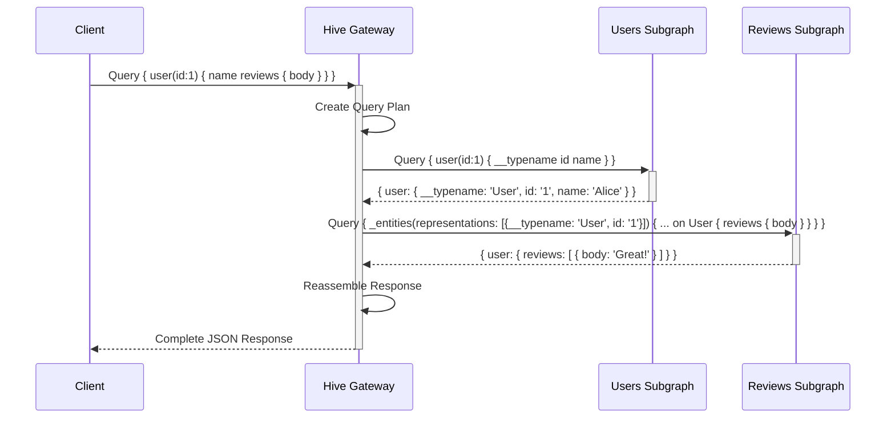
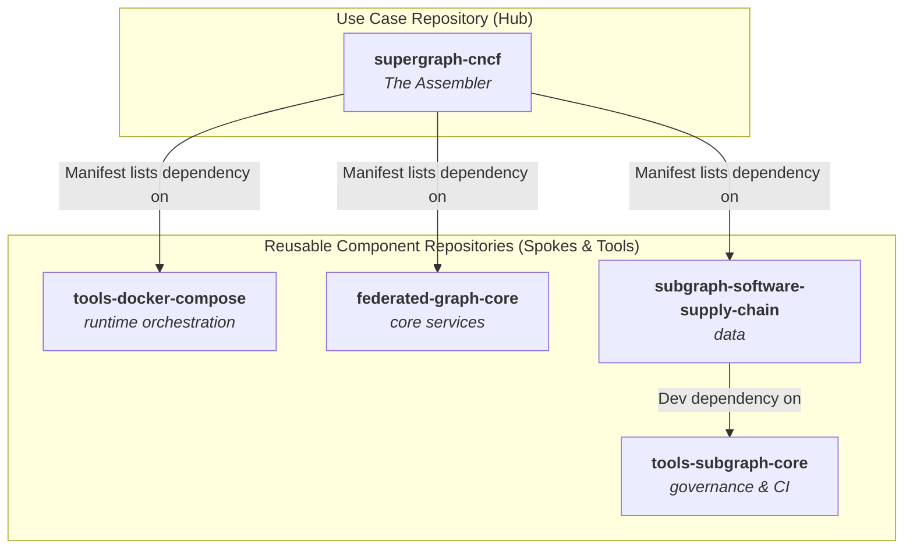
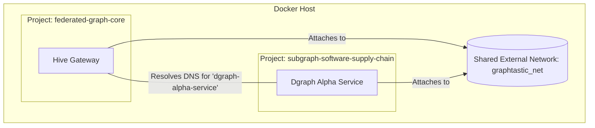
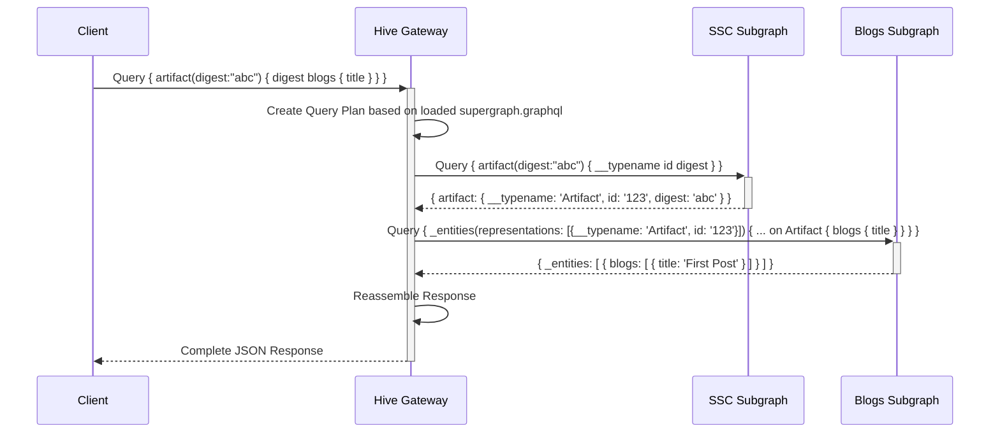
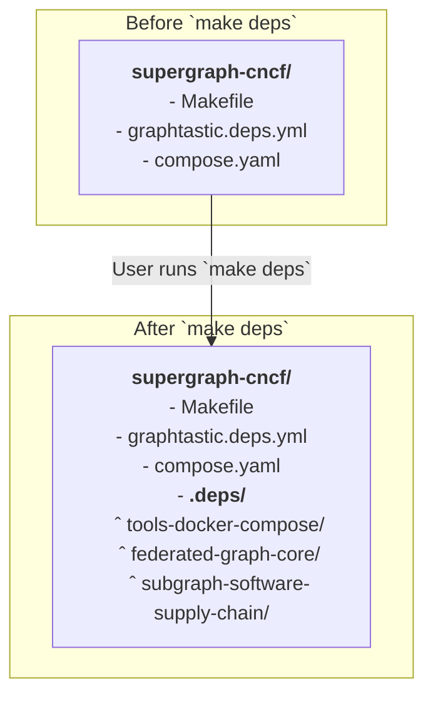
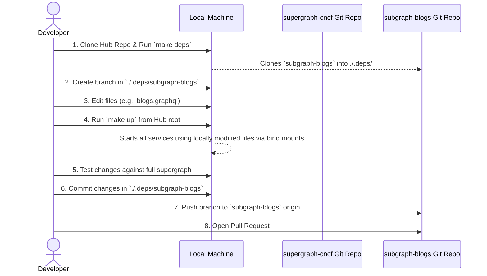
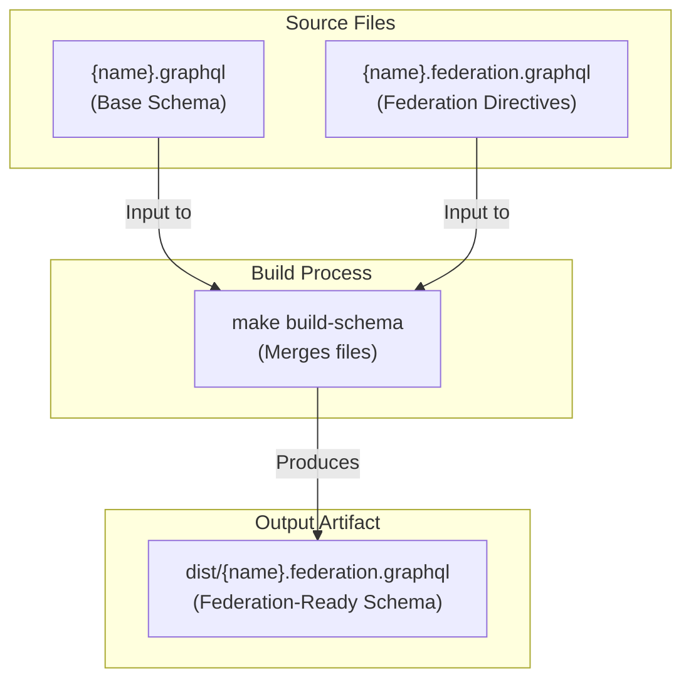
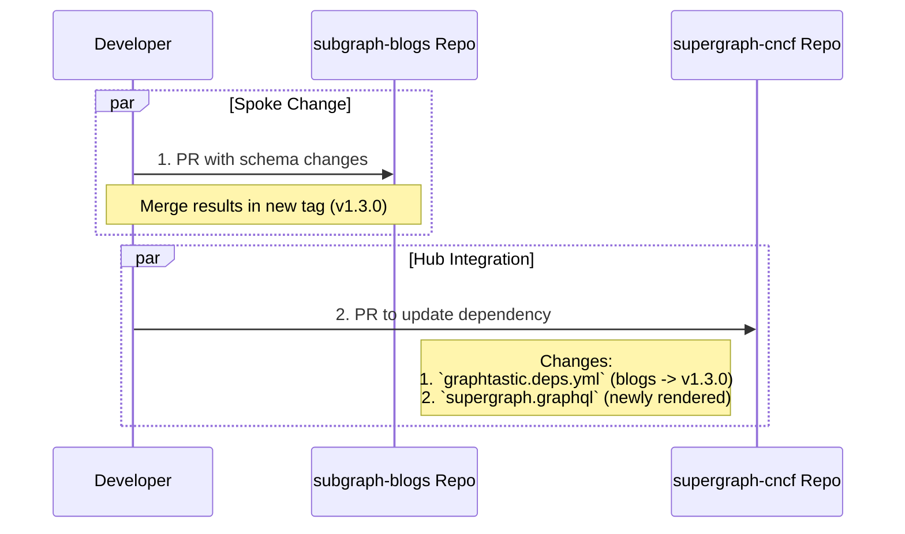

# The Graphtastic Platform Tome (Declarative Federation Edition)

- **Version:** 8.3
- **Date:** September 5, 2025
- **Status:** Approved Architectural Blueprint

### **Document Changelog**

*   **v8.3:**
    *   **Enhanced Governance & Tooling:** Introduced the `tools-subgraph-core` repository to centralize subgraph tooling, CI workflows, and `Makefile` targets, promoting ecosystem-wide consistency.
    *   **Formalized Architectural Precepts:** Added a new section (Sec 3.4) to codify the core design principles of the platform (e.g., "Hubs Assemble, Spokes Provide," "Subgraphs Are Standalone").
    *   **Standardized CI/CD Strategy:** The governance model (Sec 8.5) now specifies GitHub Reusable Workflows as the standard for consistent, centralized, and secure CI pipelines.
    *   **Defined Secret Management:** Added a new section (Sec 8.6) detailing a progressive, environment-aware secret management strategy using `.env` files and CI integration, designed to be secure and developer-friendly.
    *   **Developer-Centric Data Persistence:** Introduced a configurable data persistence model (Sec 8.7) allowing developers to switch between local directory bind mounts (for introspection) and named volumes via an environment variable.
    *   **Refined Conventions:** Renamed the dependency directory from `./vendor` to the more intuitive `./.deps` to reduce confusion. Added `template-*` repositories to the official naming conventions.
    *   **Clarified Advanced Patterns:** Added a new section (Sec 2.4) to acknowledge advanced federation patterns like inter-subgraph type extension, positioning them as a future capability.
*   **v8.2:**
    *   **Restructured for Clarity:** Consolidated all foundational technology explanations (Federation, Mesh, Hive) into a single, comprehensive Section 2.0. This removes redundancy and improves the logical flow. Section 3.0 is now exclusively focused on the Graphtastic architectural model.
    *   **Integrated Architectural Rationale:** Added a new subsection to the Hive Platform overview (Sec 2.3) detailing the polyglot persistence layer and the explicit operational trade-offs of the self-hosted model, restoring key context from prior research.
    *   **Promoted "Federation-First" Schema Best Practice:** Rewrote Section 6.1 to establish the "Federation-First" principle as the default, positioning the Dual-Schema model as a compatibility tool for legacy systems.
    *   **Enhanced Technical Accuracy:** Updated the runtime federated query diagram (Fig 4.2) to use the standard `_entities` query pattern, providing a more precise illustration of the federation mechanism.
*   **v8.1:**
    *   **Added Foundational Context:** Expanded Section 2.0 with detailed explanations of the GraphQL Federation query lifecycle and the role of GraphQL Mesh as an integration tool.
    *   **Leveraged Prior Art:** Integrated the detailed Hive Platform microservice table to add depth to the `federated-graph-core` component description.
    *   **Refined Schema Readiness Model:** Re-architected the "Dual-Schema Model" to promote a "Federation-First" best practice, positioning the dual-file approach as a compatibility tool for existing services rather than the default.
    *   Finalized all architectural diagrams and workflows based on comprehensive reviews.

---

### **1.0 Executive Summary & Vision**

This document outlines the **declarative, multi-repo architecture** for the Graphtastic Platform. It is designed for maximum reusability and independent ownership, reflecting a true microservice philosophy while providing a productive developer experience for both individual component and full-system work.

The architecture is a **"Hub and Spoke"** model:
*   **Hubs (`supergraph-*`):** "Use Case" repositories that act as assemblers. They contain no application code, only a manifest of dependencies.
*   **Spokes (`subgraph-*`):** "Component" repositories that are self-contained, runnable stacks.

Composition is achieved via a declarative manifest file that lists required components and their Git versions. Reusable orchestration tools are fetched and used by a Hub's `Makefile` to perform on-demand dependency resolution and build a final, version-controlled `supergraph.graphql` artifact.

---

### **2.0 Foundational Concepts**

To understand the architectural decisions that follow, it is essential to have a baseline understanding of the core technologies and patterns that underpin the Graphtastic Platform.

#### **2.1 GraphQL Federation Fundamentals**

GraphQL Federation builds a single, unified API (a **supergraph**) by composing multiple, independent GraphQL services (**subgraphs**). A **federation gateway** sits between the client and the subgraphs, intelligently executing queries across the distributed system.

The query execution lifecycle is a key concept:
1.  A client sends a complex query to the Hive Gateway.
2.  The gateway parses the query and, using its knowledge of the composed supergraph, creates an optimal query plan. It determines which fields need to be fetched from which subgraphs.
3.  The gateway executes this plan, sending targeted, parallel requests to the necessary subgraphs. For example, it might fetch a user's ID from a `users` subgraph first.
4.  It then uses the result of the first request (the user's ID) to query a `reviews` subgraph for that user's reviews.
5.  As the subgraphs return their data, the gateway reassembles the partial responses into a single, cohesive GraphQL response that matches the shape of the original client query.

**Figure 2.1: Federated Query Execution Flow**


#### **2.2 The Role of GraphQL Mesh: The Universal Adapter**

GraphQL Mesh is a powerful tool that can create a GraphQL API from almost any source. It acts as a universal adapter, making it a critical component for integrating existing systems into our supergraph. Mesh can:

*   **Wrap Non-GraphQL Sources:** It can introspect an OpenAPI/Swagger specification, a gRPC service definition, or even a SQL database schema and automatically generate a fully-featured GraphQL API to front that source. This is the primary on-ramp for integrating legacy services or diverse data stores.
*   **Transform Existing GraphQL APIs:** Mesh can also connect to an existing GraphQL API and apply "transforms." These can be used to rename types, add fields, or augment a schema without modifying its source code, providing a powerful compatibility layer.

In the Graphtastic architecture, a dedicated `subgraph-mesh-*` Spoke would use Mesh to wrap a source, exposing it as a standard subgraph that the Hive Gateway can consume.

#### **2.3 The GraphQL Hive Platform**

The Graphtastic Platform uses GraphQL Hive as its core engine. It is an open-source (MIT licensed) suite of tools that provides the essential machinery for our supergraph. This is encapsulated within the `federated-graph-core` Spoke.

The self-hosted Hive stack is a distributed system composed of the following key microservices:

| Service         | Responsibility                                                                 |
| :-------------- | :----------------------------------------------------------------------------- |
| `server`        | The main GraphQL API for the Hive platform itself, serving the web UI.         |
| `schema`        | Handles computationally intensive schema validation, diffing, and composition. |
| `tokens`        | Manages creation and validation of access tokens.                              |
| `usage`         | The ingestion endpoint for observability data from gateways.                   |
| `usage-ingestor`| A worker that processes usage data and stores it in the analytics database.    |
| `emails`        | Manages the sending of transactional emails (e.g., alerts).                    |
| `webhooks`      | Responsible for sending webhook notifications to external systems.             |

##### **The Polyglot Persistence Layer and Operational Considerations**
The Hive platform leverages a **polyglot persistence layer**, using the optimal database technology for each type of data:
*   **PostgreSQL:** The primary relational store for structured data like user accounts, projects, and schema history.
*   **Redis:** A high-speed cache and message broker for queuing observability data.
*   **ClickHouse:** A high-performance, column-oriented database designed for the fast analytical queries required by the observability dashboard.

While this microservice architecture provides significant scalability and resilience, it introduces non-trivial operational complexity. A team choosing to run this Spoke must be prepared to deploy, monitor, and maintain a distributed system with multiple stateful services. This operational overhead is a critical architectural trade-off.

#### **2.4 Advanced Federation Patterns: A Forward-Looking View**

The core of federation is composing independent graphs. The most advanced form of this is when one subgraph *extends* a type that is owned by another subgraph. For example:

```graphql
# In subgraph-users (owns the User type)
type User @key(fields: "id") {
  id: ID!
  name: String
}

# In subgraph-reviews (extends the User type)
extend type User @key(fields: "id") {
  id: ID! @external
  reviews: [Review!]
}
```

In this pattern, the Hive Gateway fulfills the contract by first fetching the `id` from `subgraph-users` and then passing it to `subgraph-reviews`. The subgraphs themselves remain isolated and have no direct network dependency on each other.

While the Graphtastic architecture is fully compatible with this powerful pattern, our initial architectural precepts (see Sec 3.4) recommend a "flat" dependency model to start. This reserves the use of inter-subgraph extensions for when a clear, bounded-context relationship emerges, preventing premature complexity.

---

### **3.0 The Graphtastic Architectural Model**

The Graphtastic Platform is founded on a modular, multi-repo architecture designed to promote independent development, clear ownership, and maximum reusability. This section details the core architectural patterns and the conventions that ensure a cohesive and scalable system.

#### **3.1 The "Hub and Spoke" Model**

The architecture separates concerns into four distinct repository types, creating a clear and scalable ecosystem. This model allows for both the development of standalone, reusable components (Spokes) and the composition of complex, use-case-specific applications (Hubs), all managed by a common set of versioned tools.

*   **Spokes (`subgraph-*`, `federated-graph-core`):** These are self-contained, runnable, and independently versionable components. Each Spoke repository is the single source of truth for a specific business capability or technical function.
*   **Hubs (`supergraph-*`):** These are lightweight assemblers. A Hub repository's sole purpose is to define the composition of a specific supergraph by declaring a list of Spoke dependencies and their versions in a manifest file.
*   **Tools (`tools-*`):** These are special-purpose, reusable components that provide the orchestration and governance logic for Hubs and Spokes, ensuring a consistent and updatable management process.
*   **Templates (`template-*`):** These are boilerplate repositories that serve as the starting point for creating new Hubs or Spokes, ensuring they adhere to platform conventions from day one.

**Figure 3.1: The "Hub and Spoke" Architectural Model**



#### **3.2 The Developer & Governance Toolkit**

In addition to the core runtime components, the Graphtastic platform leverages several other tools from The Guild's ecosystem to enhance the developer experience and enforce governance.

| Tool                | Role in Graphtastic Platform                                   | Key Function                                                                                                                                                                                                                         |
| :------------------ | :------------------------------------------------------------- | :----------------------------------------------------------------------------------------------------------------------------------------------------------------------------------------------------------------------------------- |
| **GraphQL Inspector** | **Automated Governance**                                       | The engine for the `make validate-schemas` command. It validates schemas against a centralized ruleset to enforce federation readiness (e.g., presence of `@key` directives) and detects breaking changes before they are committed. |
| **GraphQL Codegen** | **Developer Productivity**                                     | A recommended tool for consumers of the supergraph. It can be pointed at the Hive Registry's CDN endpoint to generate type-safe client-side code (e.g., TypeScript types and React hooks).                                     |
| **GraphQL Yoga**    | **Custom Subgraph Implementation**                             | The reference server for building custom, "greenfield" subgraphs. A `template-subgraph` provides a starting point for creating a high-performance, extensible GraphQL service when a custom business logic layer is required.       |

#### **3.3 Architectural Conventions**

To ensure consistency and clarity across the ecosystem, all repositories and files must adhere to the following conventions.

##### **Repository Naming Convention**
*   **`supergraph-{name}`:** A Hub repository that assembles a complete supergraph (e.g., `supergraph-cncf`).
*   **`subgraph-{name}`:** A Spoke repository containing a self-contained subgraph service (e.g., `subgraph-software-supply-chain`).
*   **`federated-graph-core`:** The special-purpose Spoke repository that contains the core platform services.
*   **`tools-{type}`:** A repository containing reusable orchestration or governance logic (e.g., `tools-docker-compose`, `tools-subgraph-core`).
*   **`template-{type}`:** A repository template for bootstrapping new components (e.g., `template-supergraph`, `template-subgraph`).

#### **3.4 Architectural Precepts**

All development within the Graphtastic ecosystem must adhere to the following principles. These precepts are designed to maintain the architectural integrity of the platform, ensuring it remains scalable, maintainable, and resilient.

1.  **Hubs Assemble, Spokes Provide:** Hubs (`supergraph-*`) contain no business logic; their sole purpose is to declare dependencies in their manifest. Spokes (`subgraph-*`) are the single source of truth for a business capability.
2.  **Core Services Are Agnostic:** Core components (`federated-graph-core`, `tools-*`) MUST NEVER depend on a specific business-domain subgraph. This ensures they remain generic, reusable, and focused on their core platform function.
3.  **Subgraphs Are Standalone:** Every Spoke MUST be runnable in isolation via its own `compose.yaml`. This is a critical requirement for independent development, testing, and debugging, preventing hidden dependencies between components.
4.  **Communicate Through the Supergraph:** Subgraphs MUST NOT communicate directly with each other over the network. Composition is achieved *only* through GraphQL Federation, with the query plan being executed by the Gateway. This enforces a clean architectural boundary and leverages the full power of the federated model.
5.  **Version with Intent:** All components SHOULD use Semantic Versioning to communicate the nature of their changes. Pinning to branches or SHAs in a Hub's manifest is for development purposes only; production releases MUST pin to specific, immutable version tags.

---

### **4.0 The Runtime Architecture: A System of Coordinated Projects**

The Graphtastic Platform's runtime is not a monolithic application but a system of coordinated, independent Docker Compose projects. This architecture provides strong isolation and allows for the independent lifecycle management of each component, while a shared network enables them to function as a cohesive whole. This section details the components and mechanics of the running system.

#### **4.1 The Project Isolation Model**

A core principle of the runtime architecture is the strict isolation between logical components. When the `Makefile` executes `make up`, it does not launch a single, massive Docker Compose application. Instead, it iterates through the declared dependencies and launches each one as a distinct **Docker Compose project**, using the `-p` (or `--project-name`) flag.

For example, the command `docker compose -p supergraph-cncf-core -f ./.deps/federated-graph-core/compose.yaml up -d` creates a set of containers (e.g., `supergraph-cncf-core-gateway-1`) and networks that are logically namespaced to the `supergraph-cncf-core` project. This prevents resource collisions (e.g., two components trying to create a network named `default`) and allows a developer to start, stop, or view logs for a single component project without affecting any others.

#### **4.2 The Shared Communication Bus: The External Network**

While the projects are isolated, they must communicate. This is achieved via a shared **external Docker network**. Before any service is started, the orchestration layer ensures a single bridge network (e.g., `graphtastic_net`) exists.

Each `compose.yaml` file for a component that needs to communicate with another (like the Hive Gateway or a subgraph) includes a declaration for this network with the `external: true` flag. This flag instructs Docker Compose not to create the network, but to attach the service to the pre-existing one.

This shared network provides a common communication bus with reliable, built-in DNS. A container in the `federated-graph-core` project can resolve the hostname of a service in the `subgraph-software-supply-chain` project simply by using its service name, as defined in its `compose.yaml`. This is the fundamental mechanism that enables federation.

**Figure 4.1: Inter-Project Communication via a Shared Network**



#### **4.3 The Federation Entrypoint & Core Services (`federated-graph-core`)**

This special-purpose Spoke provides the essential, non-optional machinery required to run any supergraph. At runtime, it is the central nervous system of the platform.

##### **Static Supergraph Configuration**

The **Hive Gateway** is the single entry point for all client GraphQL queries. Its most critical runtime characteristic in this architecture is its configuration. It does **not** dynamically poll a registry for its schema. Instead, it is configured to load a static, immutable `supergraph.graphql` file on startup.

This is achieved via a **bind mount** specified in the Hub's root `compose.yaml` file, which overlays the configuration onto the `federated-graph-core` gateway service. This ensures that the exact, version-controlled supergraph artifact that was reviewed and committed in Git is the one being served, fulfilling the "Render, Commit, Run" workflow.

##### **Co-located Core Services**

Alongside the Gateway, the `federated-graph-core` project runs the supporting services of the Hive platform, providing a turnkey control plane. These include the `server`, `schema`, `tokens`, `usage`, `usage-ingestor`, `emails`, and `webhooks` services.

#### **4.4 The Subgraph Runtimes (`subgraph-*`)**

The `subgraph-*` projects are the workhorses of the federated graph. At runtime, each is a self-contained, independent application stack. Its only architectural obligation is to connect its primary GraphQL service endpoint to the shared external network, making it discoverable by the Hive Gateway.

From the perspective of the runtime architecture, a subgraph is a "black box" that fulfills a schema contract. The Hive Gateway does not know or care if a subgraph is backed by a Dgraph database, a custom Node.js service, or GraphQL Mesh wrapping a legacy API. It only needs to resolve the service's hostname on the shared network and send it a valid GraphQL query, as dictated by the query plan.

#### **4.5 A Query's Journey Through the Runtime**

To make the architecture concrete, consider the step-by-step journey of a federated query through the running system.

1.  A client application sends a GraphQL query to the public port of the Hive Gateway.
2.  The Gateway receives the query. It has already loaded the committed `supergraph.graphql` on startup, so it has a complete map of the entire data graph.
3.  Using this map, it creates an efficient query plan to resolve the requested fields.
4.  The Gateway executes the plan, making a request over the shared network to the first required subgraph (e.g., `dgraph-alpha-service` in the `subgraph-software-supply-chain` project).
5.  The subgraph service processes the request and returns its data to the Gateway.
6.  The Gateway may then make subsequent requests to other subgraphs, potentially using data from the first response to inform the next query.
7.  Once all required data has been fetched, the Gateway reassembles the partial responses into a single, cohesive JSON object that precisely matches the shape of the client's original query.
8.  This final response is sent back to the client.

**Figure 4.2: Federated Query Execution Flow**



---

### **5.0 The Developer Workflow: Onboarding & Iteration**

The Graphtastic Platform's architecture is optimized for a productive and transparent developer "inner loop"—the frequent cycle of coding, building, and testing. This section details the complete workflow, from a developer's first `git clone` to contributing a change back to an upstream component.

#### **5.1 Onboarding: From Zero to Running Supergraph**

The onboarding process for any engineer joining a project built on this platform is streamlined. It begins by creating a new repository from a `template-supergraph` on GitHub, followed by two simple commands:

1.  `git clone https://github.com/graphtastic/supergraph-cncf.git`
2.  `cd supergraph-cncf && make up`

The `make up` command automatically triggers the `deps` target, which performs a one-time setup of the local development environment by fetching all necessary component repositories. The result is a complete, running supergraph, assembled and launched with no manual configuration required.

#### **5.2 Dependency Management: The "Go-Style Vendoring" Pattern**

The architecture adopts a dependency management pattern popularized by the Go language. Instead of treating dependencies as opaque, immutable packages, the `make deps` command performs a full `git clone` of each component listed in the manifest into a local `./.deps` directory.

This is a critical design choice: the `./.deps` directory contains **complete, mutable Git repositories**, synchronized to the specific version (tag, branch, or commit SHA) declared in the `graphtastic.deps.yml` manifest. The entire Git repo including the history of each component is available locally.

This approach provides two key benefits:

1.  **Reproducibility:** The `make deps` command ensures that every developer on the team has the exact same version of every component's source code, as defined in the manifest.

2.  **Productivity:** It enables the powerful iterative workflow detailed below, allowing developers to "reach into" the source of a dependency and make changes in the context of the full supergraph.

**Figure 5.1: The `make deps` Workflow Explained**



#### **5.3 The Iterative "Inner Loop": A Practical Guide**

This workflow details how a developer makes a change to a vendored dependency and contributes it back, demonstrating the power of the architecture.

1.  **Initial Setup:** A developer clones the `supergraph-cncf` Hub repository and runs `make deps`. This performs a full clone of `federated-graph-core`, `subgraph-blogs`, `subgraph-youtube`, and all other dependencies into the local `./.deps/` directory.

2.  **Making a Change:** The developer needs to add a new field to the `Blogs` subgraph.
    *   They navigate to the already-cloned repository: `cd ./.deps/subgraph-blogs/`.
    *   They create a new branch from the version that was checked out: `git checkout -b feat/add-author-field`.
    *   They open the schema file (`blogs.graphql`) and the relevant source code and make their changes directly.

3.  **Testing the Change:**
4.  *   Since subgraphs "stand alone" are are runnable in isolation, the developer can test their subgraph schema changes within the context of the subgraph repo (e.g. `./.deps/subgraph-blogs`), enabling subgraph iteration and testing directly.
    *   From the **root of the supergraph (e.g. `supergraph-cncf`) project**, they run `make up` or `docker compose restart subgraph-blogs-service`.
    *   Because the `compose.yaml` files use bind mounts for schemas and source code, Docker Compose will use the **locally modified files** from `./.deps/subgraph-blogs/`.
    *   The developer can now run queries against the local supergraph to test their changes end-to-end, validating both the subgraph schema change as well as supergraph schema composition and/or other changes such as resolver logic, all locally.

5.  **Contributing Back:** Once satisfied, the developer completes the contribution:
    *   They navigate back to `./.deps/subgraph-blogs/`.
    *   They commit their work: `git commit -m "feat: Add author field to Blog"`.
    *   They push the new branch to its upstream origin: `git push -u origin feat/add-author-field`.
    *   Finally, they open a Pull Request(s) on the subgraph (e.g. `graphtastic/subgraph-blogs`) and/or supergraph repository.

This workflow is efficient and transparent, combining the simplicity of a monorepo-like local editing experience with the structured contribution model of a multi-repo ecosystem. 

*Design note: Git sub-modules were explored and while they are an elegant solution, they are not used due to their practical complexity, cognitive overhead, and potential for error-prone workflows. They also demand of advanced git skills and often may result in poor developer UX and frustration.*

**Figure 5.2: The Iterative Development and Contribution Workflow**



#### **5.4 The Declarative Manifest in Practice**

The `graphtastic.deps.yml` manifest is the declarative heart of the vendoring system. It allows a Hub to assemble any number of subgraphs, demonstrating the scalability of the approach.

**Example `graphtastic.deps.yml` for a complex supergraph:**

```yaml
components:
  - name: tools-docker-compose
    git: https://github.com/graphtastic/tools-docker-compose.git
    version: v1.0.0
  - name: federated-graph-core
    git: https://github.com/graphtastic/federated-graph-core.git
    version: v1.3.0
  - name: subgraph-software-supply-chain
    git: https://github.com/graphtastic/subgraph-software-supply-chain.git
    version: v1.0.0
  - name: subgraph-blogs
    git: https://github.com/graphtastic/subgraph-blogs.git
    version: v1.2.1
  - name: subgraph-youtube
    git: https://github.com/graphtastic/subgraph-youtube.git
    version: main
```

---

### **6.0 Component Deep Dive: The Spoke (`subgraph-*`)**

#### **6.1 Schema Federation Readiness: The "Federation-First" Principle**

A core principle of the Graphtastic Platform is **"Federation-First."** For any new, greenfield Spoke (`subgraph-*`), the default and strongly recommended best practice is to maintain a **single, unified schema file** (`{name}.graphql`).

Federation directives (like `@key`, `@shareable`, `@external`) are designed to be additive and are ignored when the GraphQL server/endpoint is not configured for federation. Therefore, including them directly in the base schema simplifies the component's structure, eliminates build steps (to generate federation schemas dynamically or via CI), and makes the schema's contract explicit and unambiguous.

#### **6.2 The Dual-Schema Model (For Compatibility)**

The **Dual-Schema Model** described below should be considered a compatibility bridge, not the default pattern. It is a powerful on-ramp for integrating existing services where the source schema cannot be modified, but it should be the exception rather than the rule.

*   **`{name}.graphql`:** The base SDL, which can be an unmodified, non-federated schema.
*   **`{name}.federation.graphql`:** An extension file containing *only* the external federation directives required to integrate the base schema.

A `make build-schema` command within the Spoke merges these files into a final, federation-ready artifact (`dist/{name}.federation.graphql`). This allows the Spoke to run in "standalone mode" using its original schema, while providing a composable artifact for Hubs.

**Figure 6.1: Spoke Component Schema Anatomy**



---

### **7.0 Assembly Deep Dive: The "Render, Commit, Run" Workflow**

Supergraph composition is a build-time step that produces a version-controlled artifact. This workflow is a two-phase process spanning both the Spoke and Hub repositories.

#### **7.1 The Two-Phase Contribution Process**

1.  **Phase 1: Update the Spoke.** A developer makes a schema change in a Spoke repository (e.g., `subgraph-blogs`), updates its `dist/` artifact, and gets a PR merged. This results in a new versioned release (e.g., Git tag `v1.3.0`).
2.  **Phase 2: Integrate into the Hub.** A second PR is opened in the `supergraph-*` Hub repository. This PR contains two explicit changes:
    *   An update to `graphtastic.deps.yml` to point to the new Spoke version (`v1.3.0`).
    *   The new `supergraph.graphql` artifact, generated by running `make supergraph`.

**Figure 7.1: The Two-Phase Contribution Workflow**



---

### **8.0 Orchestration, Governance, & Validation**

This section details the operational core of the Graphtastic Platform. It describes the reusable tooling, the developer-facing `Makefile` commands, and the automated governance workflows that ensure the integrity and stability of the entire federated ecosystem.

#### **8.1 The Core Tooling Repositories**

To adhere to the "Don't Repeat Yourself" (DRY) principle and to ensure a consistent operational experience across all supergraphs, core logic is extracted into its own reusable, versioned components.

*   **`tools-docker-compose`:**     Provides the runtime orchestration layer for Hubs. It contains the canonical, master `Makefile` and all associated scripts for discovering and managing the lifecycle of Docker Compose projects declared in the manifest.
*   **ROADMAP: `tools-kubernetes`** Planned for future component to provide Kubernetes-native deployment and management tooling, enabling Hubs to run in cloud-native environments with the same declarative simplicity without requiring changes to existing subgraph-* and supergraph-* repositories.
*   *   **`tools-subgraph-core`:**  A development dependency for Spokes. It provides the canonical tooling, `Makefile` includes, and reusable CI workflows for developing, validating, and testing a compliant subgraph, ensuring all Spokes adhere to the same quality and governance standards.

#### **8.2 The Orchestration Layer (`tools-docker-compose`)**

A Hub's local `Makefile` is a simple, lightweight shim that fetches the `tools-docker-compose` component (or `tools-kubernetes` in the future) and then delegates all operational commands (`up`, `down`, `logs`) to the master `Makefile` within the vendored repo. This ensures all supergraphs benefit from a consistent, centralized, and updatable set of management tools, and decouples the orchestration implementation from the rest of the subgraph and supergraph repositories.

#### **8.3 The Core Makefile: The Developer's Control Plane**

The `Makefile.core`, provided by the `tools-docker-compose` component, is the definitive "API" for managing the lifecycle of any supergraph. It provides a set of standardized, self-documenting targets that cover the entire development and validation workflow.

**The Comprehensive `Makefile.core`:**

```makefile
# This is the core Makefile, located in `tools-docker-compose`.
# It is called by a Hub's lightweight, root Makefile.

# Default variables
DEPS_DIR := ./.deps
MANIFEST := ./graphtastic.deps.yml
SUPERGRAPH_SDL := ./supergraph.graphql

# This allows passing a stack name, e.g., `make logs stack=subgraph-blogs`
stack ?= all

.PHONY: help up down clean restart deps supergraph validate-schemas validate ps logs

help:
	@echo "Graphtastic Platform - Master Orchestrator"
	@echo "--------------------------------------------"
	@echo "Usage: make [target] [stack=<stack_name>]"
	@echo ""
	@echo "Lifecycle Targets:"
	@echo "  up                 - Start all services defined in the manifest."
	@echo "  down               - Stop and remove all services."
	@echo "  clean              - Run 'down' and remove shared Docker resources (networks, volumes)."
	@echo "  restart            - Restart all services."
	@echo ""
	@echo "Dependency & Build Targets:"
	@echo "  deps               - Sync/update local dependencies from the manifest."
	@echo "  supergraph         - Render the final supergraph.graphql artifact."
	@echo "  validate-schemas   - Validate all subgraph schemas for federation readiness."
	@echo "  validate           - Run both 'validate-schemas' and 'supergraph' targets."
	@echo ""
	@echo "Interactive & Debugging Targets:"
	@echo "  ps                 - Show the status of running containers. Use 'stack=' to target one."
	@echo "  logs               - Tail the logs of services. Use 'stack=' to target one."
	@echo ""
	@echo "Examples:"
	@echo "  make logs stack=subgraph-blogs"
	@echo "  make ps stack=federated-graph-core"

up: deps
	@echo "🚀 Bringing up all services..."
	./$(DEPS_DIR)/tools-docker-compose/scripts/manage-stacks.sh up $(MANIFEST)

down:
	@echo "🔥 Bringing down all services..."
	./$(DEPS_DIR)/tools-docker-compose/scripts/manage-stacks.sh down $(MANIFEST)

clean: down
	@echo "🧹 Removing shared Docker resources..."
	@docker network rm $$(grep SHARED_NETWORK_NAME .env | cut -d '=' -f2) 2>/dev/null || true
	# Add similar commands for shared volumes as needed

restart: down up

deps:
	@echo "🔄 Syncing component repositories from $(MANIFEST)..."
	./$(DEPS_DIR)/tools-docker-compose/scripts/sync-deps.sh $(MANIFEST) $(DEPS_DIR)

supergraph: deps
	@echo "✍️ Rendering supergraph artifact..."
	npx mesh-compose --config ./mesh.config.js > $(SUPERGRAPH_SDL)

validate-schemas: deps
	@echo "🔎 Validating subgraph schemas for federation readiness..."
	./$(DEPS_DIR)/tools-docker-compose/scripts/validate-schemas.sh $(DEPS_DIR)

validate: validate-schemas supergraph

ps:
	@echo "📊 Status for stack: $(stack)"
	./$(DEPS_DIR)/tools-docker-compose/scripts/manage-stacks.sh ps $(MANIFEST) $(stack)

logs:
	@echo "📜 Tailing logs for stack: $(stack)..."
	./$(DEPS_DIR)/tools-docker-compose/scripts/manage-stacks.sh logs $(MANIFEST) $(stack)
```

#### **8.4 A Deeper Look at the Operational Targets**

##### **Lifecycle Management (`up`, `down`, `clean`, `restart`)**
These targets manage the entire supergraph environment. The `manage-stacks.sh` script is responsible for parsing the manifest and iterating through each component, running the appropriate `docker compose -p ...` command for each one. The `clean` command is particularly important for developers, as it provides a one-command way to completely reset their environment to a known-good state.

##### **Dependency and Build Workflow (`deps`, `supergraph`, `validate-*`)**
This set of commands forms the core of the "pre-flight check" and governance workflow.
*   `deps`: The idempotent script that ensures the `./.deps` directory is an exact reflection of the versions declared in the manifest.
*   `validate-schemas`: Uses GraphQL Inspector to "lint" every subgraph schema, ensuring it is federation-ready.
*   `supergraph`: The "render" step that generates the final, reviewable `supergraph.graphql` artifact.
*   `validate`: A convenience target that runs both schema validation and supergraph rendering, providing a single command for developers to run before committing changes.

##### **Interactive Debugging (`ps`, `logs`)**
These targets are designed for day-to-day development and debugging. They are parameterized to provide both broad and targeted introspection into the running system.
*   `make ps`: By default, this will show the status of all containers across all running projects that are part of the supergraph.
*   `make ps stack=subgraph-blogs`: This will target *only* the Docker Compose project for the `subgraph-blogs` component, showing just the status of its containers. This is essential for focusing on a single component in a complex environment.
*   `make logs`: This will tail the logs from *all* services in the supergraph, providing a high-level view of system activity.
*   `make logs stack=federated-graph-core`: This is the most common debugging command. It allows a developer to zero in on the logs from a specific component—in this case, the core Hive platform—to diagnose issues without noise from other services.

#### **8.5 Governance & Validation Workflows**

The platform enforces schema integrity and best practices through a combination of local tooling and automated CI governance.

##### **Local Governance**
The `tools-subgraph-core` component provides a `Makefile.subgraph.core` and validation scripts. This enables every developer to run canonical checks (e.g., `make validate-federation`) on a Spoke before committing, ensuring compliance with platform rules.

##### **CI/CD Governance via Reusable Workflows**
The CI pipeline, triggered on every Pull Request, acts as an automated gatekeeper. We use **GitHub's Reusable Workflows** feature, with the canonical workflow logic defined in the `tools-subgraph-core` repository. A Spoke's own CI file is a minimal, secure shim that calls this centralized workflow, ensuring every Spoke is validated against the same up-to-date logic without code duplication or security risks.

```yaml
# In a subgraph's .github/workflows/ci.yml
jobs:
  validate:
    uses: graphtastic/tools-subgraph-core/.github/workflows/subgraph-ci.yml@v1.0.0
    secrets: inherit

#### **8.6 Secret Management**

We employ a progressive, environment-aware strategy consistent with 12-Factor App principles. It defaults to being secure and requires no initial developer configuration.

1.  **Level 1 (Zero Config - Local Dev):** Services in `compose.yaml` use insecure, documented defaults for local development (e.g., `POSTGRES_PASSWORD: ${POSTGRES_PASSWORD:-password}`). This allows the stack to run "out of the box" without manual setup.
2.  **Level 2 (Local Override):** Repositories that require secrets provide a `.env.template` file. Developers can copy this to a `.gitignore`'d `.env` file to provide custom values, which are automatically loaded by Docker Compose.
3.  **Level 3 (CI/CD & Production):** Automated environments generate the `.env` file at runtime, or use ENV variables to override values in a .env file from a secure store, such as GitHub Actions secrets or a dedicated secret manager like HashiCorp Vault. No secrets are ever committed to the repository.

#### **8.7 Configurable Data Persistence**

To optimize the developer experience and provide flexibility, data persistence for stateful services is configurable, and adheres to the 12-Factor principle of separating backing services. This is managed via an environment variable that alters the `volumes` section in `compose.yaml` files.

*   **Default (Bind Mount):** By default (`PERSISTENCE_MODE=bind`), services mount a local `./data` directory within their project folder (e.g., `./.deps/federated-graph-core/data/postgres`). This makes the data transparent and easily accessible for inspection or modification during development.
*   **Optional (Named Volume):** By running `make up mode=volume`, developers can switch to using standard, persistent Docker named volumes. 

The `make clean` target is configured to intelligently remove either the local data directories or the associated named volumes, providing a complete "factory reset" for the developer's environment.